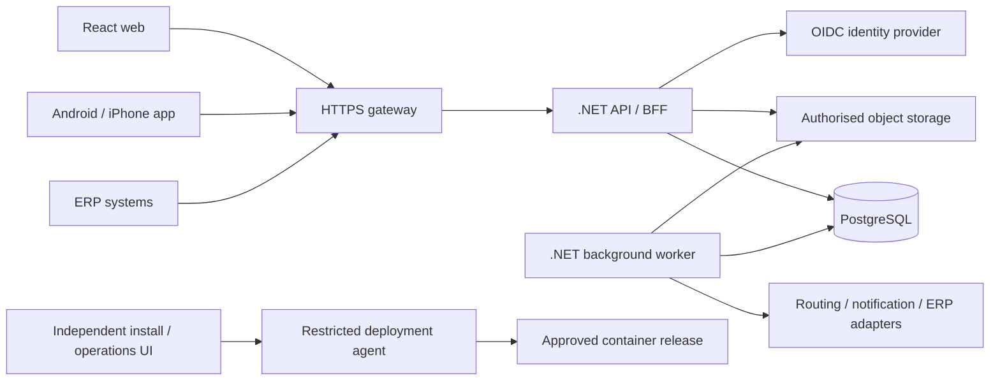

# ADR 0001 — .NET modular application, PostgreSQL and React

Status: stack confirmed; detailed architecture proposed for M01 review.

## Decision

Use .NET 10 LTS for the application API/domain and background services, PostgreSQL for durable business state, and React with TypeScript for the web UI. The user chose these technologies on 2 October 2026. .NET SDK 10.0.400 is available and pinned for the M01 executable examples. Keep dependency/image patch levels locked and update them through tested releases; do not use mutable `latest` tags in release manifests.

Start with a modular monolith whose bounded contexts have separate domain/application/infrastructure modules and owned persistence schemas. Deploy the API/BFF and background worker separately from the same versioned release when required. This keeps booking, dispatch reservation and outbox commits explicit without introducing distributed transactions before scale requires them. Extract services only when independent scaling/ownership or operational evidence warrants it.

React exposes dispatcher, commercial, finance, portal and tenant/system administration journeys through a registered route catalogue. Prefer a browser BFF with secure HTTP-only sessions and server-side permission checks. Map widgets and route geometry are supplied through an adapter, with list/keyboard equivalents. The mobile framework remains a separate decision; React web choice does not promise mobile background GPS.

PostgreSQL row-level security complements application tenant policies. Runtime roles are neither table owners, superusers nor BYPASSRLS roles; migrations use a separate narrowly managed identity. Use FORCE ROW LEVEL SECURITY where applicable, transaction-local authenticated tenant context, tenant-scoped composite keys/FKs and fail-closed queries. Test pool reuse, background work, exports, caches, files, realtime subscriptions and integrations with two adversarial tenants. PostgreSQL security is not implemented or proven by M01 examples.

## Runtime boundaries

The production console stores control state separately from the TMS database and remains reachable during application/database failure. The deployment agent accepts predefined versioned operations against approved image digests; it has no arbitrary shell/image/mount endpoint. An installer can inspect prerequisites, configure secret references, review a release, deploy, verify readiness, recover and show audited logs. No model or browser directly receives the Docker socket.

## Contracts and consistency

Each context owns its aggregates and table writes. Synchronous published interfaces serve in-process queries/commands; explicit versioned events cross asynchronous boundaries. Commit business changes and an outbox record atomically; consumers maintain an inbox/idempotency boundary. ERP payloads are mapped into internal commands through an anti-corruption layer with tenant-scoped credentials and reconciliation.

Dispatch revalidates an immutable proposal/version at publication. Reserve jobs and resource intervals transactionally, lock in deterministic order, apply optimistic versions and applicable PostgreSQL constraints. Failed publication commits neither reservations nor dispatch events. Completed execution/POD history is immutable; a replan is a new version of remaining work. Finance consumes accepted events and versioned commercial snapshots without deriving invoices from GPS or mutable current tariffs.

## Deferred choices

Production PostgreSQL major/patch/image digest and extensions are confirmed with driver compatibility and restore/migration rehearsals in M02. The initial version should be a supported release; no version is selected solely from a cached claim. Queue broker, shared cache and specialised optimisation service are optional extensions after measured need. Route providers, identity, object storage vendor, mobile framework, fleet scale and SLOs remain recorded decisions.

## Consequences and evidence

The architecture provides clear module ownership and a container path while limiting first-release operational complexity. It requires automated architecture dependency tests, real PostgreSQL transaction/isolation tests, API policy tests and a separate operations control plane in later milestones. M01 tests are executable specifications of selected rules; they do not replace those checks.

Primary sources: [Microsoft .NET support policy](https://dotnet.microsoft.com/en-us/platform/support/policy) identifies .NET 10 as LTS; [PostgreSQL row security documentation](https://www.postgresql.org/docs/current/ddl-rowsecurity.html) explains owner/superuser bypass and policy behaviour. Architecture tradeoffs here are design recommendations based on those capabilities.
