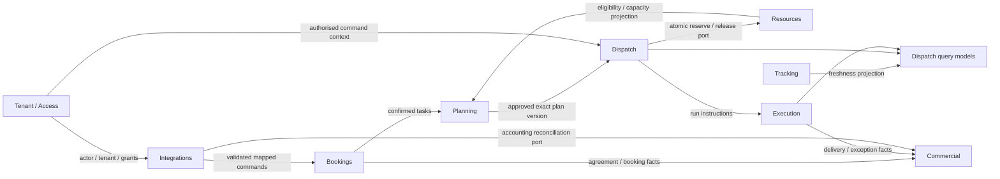
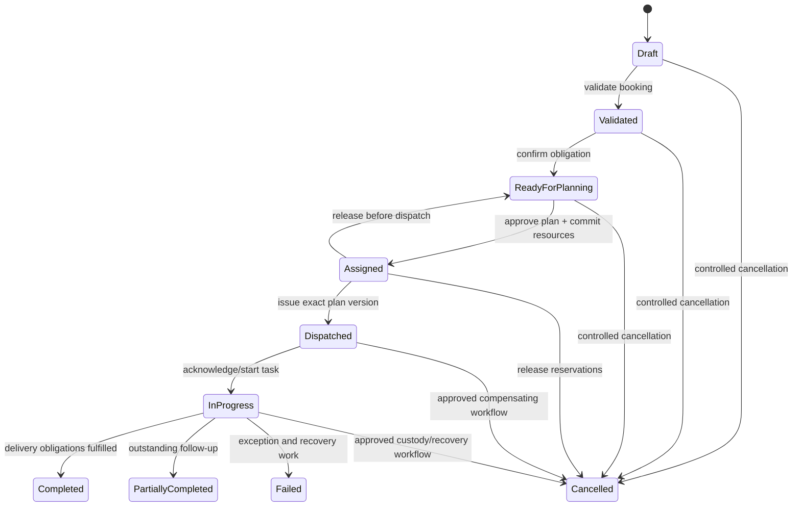
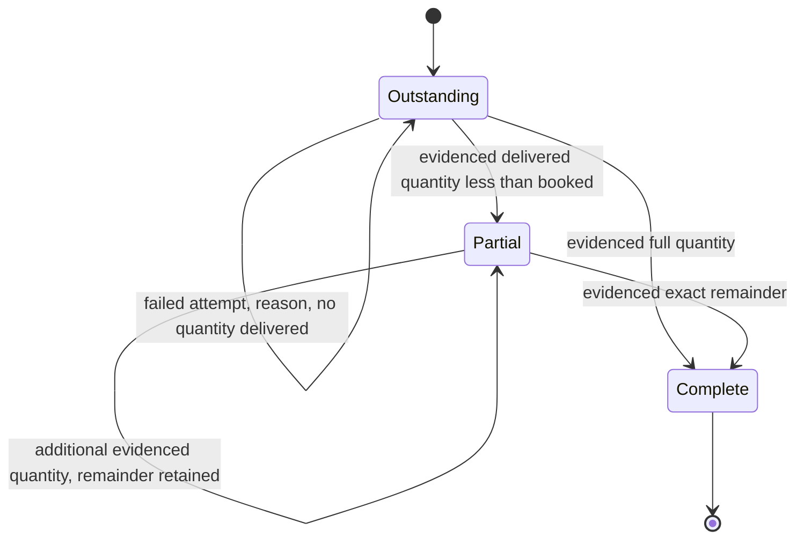
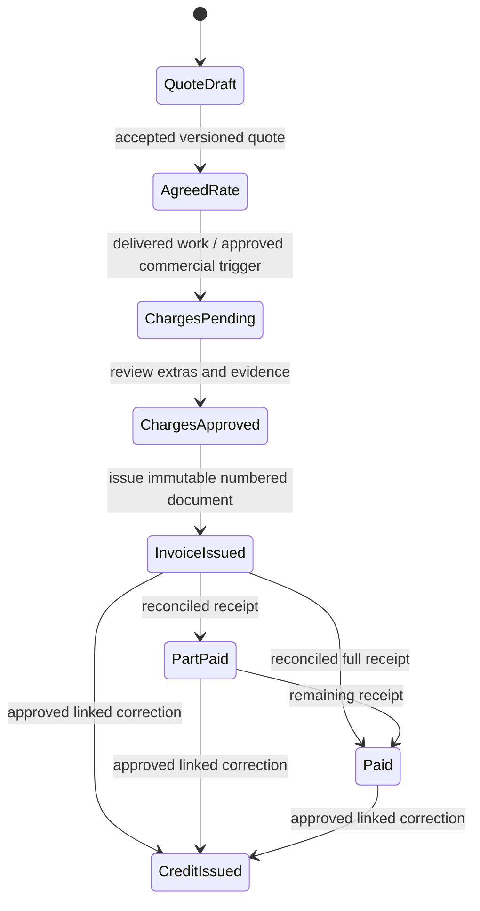

# M01 domain model and integration contracts

Status: review candidate, 2 October 2026. Requirements: DDD-01–05, SCOPE-01–04, BOOK-01–05, PLAN-02/05/06, MOBILE-02/05/06 and FIN-01/02. UK and .NET/PostgreSQL/React are confirmed. This design starts with freight and delivery; the examples target the installed .NET 10 SDK. The detailed model still needs operational review. Open provider, cargo, jurisdiction, scale, identity and hosting decisions are recorded in `scope-and-decisions.md`.

## Shared language

| Term | Meaning and ownership |
|---|---|
| Tenant | Contract and security boundary. Every operational reference includes tenant ID. A depot, customer or subcontractor is not automatically a tenant. |
| Order | Customer's requested commercial/operational work; Bookings owns intake, validation and controlled amendments. |
| Consignment | Freight goods and their required movement. Bookings owns booked quantities and legs; Execution owns attempt/evidence history against the consignment reference. |
| Transport task | A schedulable service obligation: collection, delivery, transfer or return. Bookings supplies freight tasks; later service contexts supply their own obligations. |
| Stop | Place, service operation, duration and time window within a proposed route. Stop sequence must preserve pickup-before-delivery and cargo constraints. |
| Route proposal | Planning's versioned candidate sequence and feasibility result, including provider provenance. It is not a dispatched commitment. |
| Run | Dispatch's approved operational instruction for a driver/resources, referencing an exact accepted plan version. |
| Reservation | Resources' exclusive commitment of a task to named drivers/vehicles/trailers over half-open UTC intervals. It is committed atomically, not inferred from the map. |
| Delivery attempt | Execution's immutable result and evidence for one attempt. A repeat upload uses the same attempt ID. |
| POD | Proof-of-delivery evidence associated with goods actually delivered. GPS proximity alone is not POD. |
| Exception | Typed operational issue, reason and outstanding work: shortage, damage, failed collection/delivery, delay or changed requirements. |
| Tracking source | Authenticated driver-device session initially; a vehicle telematics source later. Source-to-driver/vehicle assignment is explicit and time-bound. |
| Rate snapshot | Commercial's agreed rate version, quantity basis, currency, components and rounding provenance. Later tariff changes do not rewrite it. |
| Charge / invoice | Commercial's approved billable line / issued financial document. A delivery outcome and payment status are separate facts. |
| Subcontractor | Supplier allocated selected work with a scoped identity. Allocation does not grant access to the tenant's other work or unrestricted rates. |
| Projection | Query model assembled from owned events, with a watermark/freshness marker. It does not bypass command validation. |

## Context ownership

Start with a modular .NET application and independent workers for optimisation, messaging, tracking and deployment operations. Contexts own logical PostgreSQL schemas and repository interfaces. The names below define design boundaries, not deployed microservices or implemented schemas. Dependencies go through owned application contracts or projections; direct writes/joins through another context's repositories are forbidden. Architecture tests are required when modules are created.

| Context / proposed schema | Authoritative data and aggregates | Commands, events and dependencies |
|---|---|---|
| Bookings / `bookings` | `Order`, `Consignment`; customer operational contacts, addresses, cargo specifications, ordered tasks and approved amendments | Validate/confirm/amend order; `booking.confirmed`, `booking.amended`. Commercial quote references and tenant policy enter through ports. |
| Planning / `planning` | `RoutePlan` with immutable versions, optimisation request, constraint/provenance and feasibility explanations | Propose/replan/approve proposal; `planning.plan_proposed`, `planning.plan_approved`. Reads booking/resource projections; uses road, geocode and optimiser ports. |
| Dispatch / `dispatch` | `Run`, selected plan version, operational assignments and allocation acknowledgements | Dispatch/withdraw/reallocate run; `dispatch.run_dispatched`, `dispatch.run_withdrawn`. Requires current booking/eligibility validation and Resources' atomic reservation port. |
| Execution / `execution` | `DeliveryProgress`, `DeliveryAttempt`, exception/custody evidence and follow-up obligations | Start task, record delivery/exception, issue correction/follow-up; `execution.delivery_recorded`, `execution.exception_recorded`. Uses dispatch instruction and document storage ports. |
| Tracking / `tracking` | `TrackingSource`, assignment/session and location stream; latest-position projections | Register source, start/end work session, ingest position; `tracking.source_changed`. GPS ingestion is independent of delivery aggregates; supplies live freshness to queries. |
| Resources / `resources` | `Driver`, `Vehicle`, `Trailer`, shift/eligibility, depot, maintenance/defect and `Reservation` commitments | Maintain resource, commit/release/amend reservation; `resources.availability_changed`, `resources.reservation_committed`. Owns the exclusive scheduling transaction. |
| Commercial / `commercial` | `Quote`, `RateAgreement`, `Charge`, `Invoice`, credit and reconciliation; agreed tariff and supplier costs | Accept quote, approve extra, issue invoice/credit, reconcile receipt; `commercial.charge_approved`, `commercial.invoice_issued`. Consumes booking/execution facts; accounting adapter is an integration port. |
| Integrations / `integrations` | `Connector`, external-ID mapping, inbound/outbound delivery and reconciliation status | Receive mapped ERP command; configure webhook/retry/reconcile. Owns adapter schemas and transport, never the booked/financial truth. Calls domain ports after validation. |
| Tenant/Access / `access` | `Tenant`, membership, role/grant, depot/business-unit scope, registered menu configuration, support delegation and audit policy | Manage membership, scoped service/device identity and menus; `access.membership_changed`, `access.policy_changed`. Supplies authenticated actor/tenant context to every command. |

Customer invoice/billing details are owned by Commercial; Bookings keeps operational contact/address snapshots. Both use a tenant-qualified party reference and explicit update contracts. Sensitive snapshots have retention rules; neither context silently synchronises the other's database tables.



The diagram shows contract flow, not reciprocal CLR/persistence references. Planning and Dispatch use a small immutable transport-obligation contract; Resources answers the reservation port owned by its application module. Integrations references public contracts only. Command authorisation is evaluated at the server, with deny-by-default tenant/depot/customer/subcontractor scope. Menu visibility never grants permission.

## Lifecycle ownership and controlled corrections

Operational, delivery and financial states are independent. A dispatcher reads a composed operational projection; Bookings does not reach into Execution or Commercial to force a status. The executable `OperationalState` policy below is a condensed lifecycle example, not an implemented aggregate spanning all contexts.



The policy rejects shortcuts and reopening terminal results. Its cancellation flag demonstrates a business approval requirement; it is not authorisation or evidence that custody/reservation compensation has run. Actual application commands must persist actor/reason/approval and enforce compensation before presenting cancellation as finished. After partial/failed execution, create a linked follow-up task or attempt. Preserve the original outcome and customer amendment impact.



Each transition appends an immutable attempt. Retrying the identical attempt ID/body has no effect. Reusing an ID with changed quantity/evidence is rejected; correction appends a separately authorised record referencing the original. The example permits cumulative attempts against one consignment and stops further attempts once complete. A production task model distinguishes attempted leg, follow-up task, return and custody location explicitly.



Financial settlement never determines delivery completion. Invoice corrections issue linked credit/debit documents according to reviewed accounting policy rather than mutating issued totals. Tax rules, numbering and retention require reviewed provider/jurisdiction policy; this milestone does not implement them.

## Aggregate invariants and concurrency

| Boundary | Invariants and transaction policy | Executable evidence / remaining proof |
|---|---|---|
| Order/consignment | Tenant-qualified IDs, positive booked quantities, explicit unit types, valid pickup/delivery relationships and time windows. Amendments preserve revision, actor, reason and downstream impact. | Reference and quantity examples exist. Full booking validation/amendment application tests remain planned. |
| Route plan | Candidate versions never overwrite dispatched versions. Replanning validates pickup-before-delivery, eligibility and every-stop load, not just final total. Hard violations block commitment; provider assumptions/capabilities are visible. | `PLAN-LOAD-01` rejects transient overload/negative load. No real optimiser or UK truck-route proof yet. |
| Reservation | A task has one active commitment; related driver, vehicle and trailer commitments succeed or fail together. Intervals are UTC `[start,end)`, so adjacent intervals do not collide; turnaround/travel buffers must be included in the reserved interval. Every resource belongs to the command tenant. | Four reservation examples include two actual in-memory competing threads at one expected version. They do not prove PostgreSQL behaviour. |
| Delivery progress | `0 <= delivered <= booked`; `outstanding = booked - delivered`; delivered quantity requires evidence; incomplete/failed attempts require a reason. Same immutable attempt ID/body is idempotent, changed-body replay is invalid. | Five delivery examples. Freight unit conversion, custody/return corrections and real offline/API sync tests remain planned. |
| Agreed price/charge | Accepted rate snapshot fixes version, quantity basis, components, currency and rounding policy; extras require an approval reference. Never consult the latest tariff to reconstruct an agreed charge. Credits are separately typed. | Two price examples use illustrative GBP, nonnegative money and two decimal rounding away from zero. Tax/FX/all-currency policy is not implemented. |
| Invoice | Issued amounts, currency, source charge IDs and numbering provenance are immutable. Each approved source charge is invoiced once; repeated events/requests cannot duplicate a bill. | Design contract only; durable billing/inbox uniqueness tests remain planned. |

Resources owns reservation concurrency. Dispatch publication first revalidates the exact proposal and current booking/resource versions through authoritative owning ports. A shared application unit of work enlists Dispatch's run repository and Resources' reservation port in one PostgreSQL transaction: the task commitment, each exclusive resource interval, run state and each owner's outbox records commit or roll back together. Each context writes only its own tables through its own repository; the orchestration does not grant Dispatch direct Resources persistence access. Standalone resource amendments use the same owning reservation policy. A tenant-qualified uniqueness rule prevents two active task commitments; an interval exclusion rule or equivalent serialised resource schedule prevents overlaps. A replacement atomically releases/amends old commitments and checks all new resources. Version compare-and-swap returns a conflict requiring refresh; no silent retry against a changed plan. Deadlock retries are bounded and preserve the request's idempotency key.

The example `InMemoryReservationBook` uses a lock and an immutable snapshot to demonstrate one winner at the same version. Its tenant-wide list/version is a teaching adapter, not the production aggregate or a recommendation to serialize all tenant scheduling. Production schedules partition by resource; grouped commitments retain transaction consistency. Required later database tests use separate connections, simultaneous transactions, overlapping multi-resource requests, stale plan/resource versions, cross-tenant IDs, rollback after a partial write and crash before publish. Events alone cannot enforce exclusivity.

Quantities carry both value and unit; cargo count/weight/volume and vehicle/seat capacities are distinct types. Booking preserves original unit values and approved conversions. Coordinates use validated latitude/longitude ranges; timestamp instants are UTC, local time windows retain timezone, DST ambiguity requires explicit input policy. These richer value types are contract requirements; the current example uses integer cargo units and one decimal load dimension only.

Partial delivery does not erase cargo. Delivered, outstanding, returned, damaged and lost/custody quantities need explicit reconciliation and reasons. A follow-up may deliver only the outstanding quantity; returned/damaged goods are not counted as delivery to the consignee. Unit, rounding and custody policy for each cargo type remain decisions under CARGO-01. A credit changes the financial ledger, not historical delivered quantities.

## Versioned events, commands and external mapping

`contracts.json` is the machine-readable catalogue. The complete v1 envelope includes `eventId`, `tenantId`, `eventType`, `schemaVersion`, producer, tenant-qualified aggregate identity, monotonically increasing aggregate sequence, UTC occurrence time, correlation/optional causation IDs and validated payload. The executable envelope class checks the metadata subset; it is not a complete JSON/API implementation.

Business state and the outbox record commit together. Publisher retries preserve event identity. Consumers validate producer/version/tenant, then commit inbox identity and domain change in the same transaction. Ordered consumers compare aggregate sequence, ignore already-applied events and retain/reconcile gaps rather than advancing over missing facts. Out-of-order history cannot reverse completed state. Schema compatibility/deprecation is reviewed; unsupported major versions enter reconciliation. Rebuildable projections store watermarks and show freshness where dispatch decisions depend on them.

ERP adapters map external IDs/statuses into owned commands through an anti-corruption layer. `DELIVERED` means a reported delivery milestone, not permission to complete a task or issue an invoice; tenant, assignment, quantities, evidence and current state must still validate. Unknown statuses fail closed into reconciliation. Inbound request deduplication is scoped to tenant/connector/operation/key and rejects changed payloads. APIs require server-verified scoped service identities, optimistic concurrency, explicit errors and pagination. Webhooks require signed deliveries, bounded retries and observable dead-letter/replay flows. None of these transport/security behaviours is implemented by the C# metadata examples.

Driver devices initially ingest authenticated work-session locations into Tracking. Payloads carry source ID, observed/received times, sequence, accuracy and assignment; delayed positions remain history and cannot replace a newer live projection. A later vehicle telematics adapter uses the same tracking-source contract with explicit vehicle assignment. Raw/high-rate positions do not create a delivery aggregate event per ping and cannot establish POD. Background/offline GPS requires actual Android/iPhone field tests and privacy review.

## Mixed-service extension

Freight owns consignments, cargo handling, leg/custody transitions and POD. A future Passenger Services context owns passenger journeys, seats, boarding/alighting, accessibility and passenger-specific evidence. It emits a versioned transport-obligation contract containing task/stop/resource/time/capacity requirements through its own planning adapter. Passenger identifiers do not enter cargo fields or freight history.

Planning accepts typed capacity/eligibility constraints; Resources still owns exclusive driver/vehicle/trailer reservations. Mixed vehicle use needs an explicit compatibility policy for concurrent freight/passenger obligations, service duration, equipment and scheduling. Adding a service type therefore extends an adapter/constraint catalogue without changing prior freight records. Passenger operations remain out of current implementation scope and require their own acceptance/security/compliance review.

## TDD evidence and review limits

The dependency-free console specification harness is `tests/Tms.Contracts.Tests/Tms.Contracts.Tests.csproj`, referencing `examples/Tms.Contracts/Tms.Contracts.csproj`. Run from the repository root:

```sh
dotnet run --project tests/Tms.Contracts.Tests/Tms.Contracts.Tests.csproj --configuration Release
```

Seventeen named scenarios were written first, then executed against rule stubs: **RED 0 passed / 17 failed**. After implementing the rules: **GREEN 17 passed / 0 failed**, .NET SDK 10.0.400, Release. Retained results are in [the assessment records](evidence/README.md), including the independent final run and checked source hashes. An earlier local NuGet configuration permission failure is retained outside the repository and is not counted as RED. A local offline NuGet config and process-only SDK/package/config directories avoided external package dependencies.

Scenario IDs and requirement mappings are in `contracts.json` and the M01 traceability inventory. These examples establish domain-policy candidates; they do not complete production acceptance criteria. Database exclusivity/recovery, tenant authentication/authorisation, API/webhook durability, real routing/GPS/mobile behaviour, schema migrations/restore, UI usability/accessibility and jurisdiction-specific compliance remain unimplemented or unverified. M01-T02 is ready for review of this candidate and its examples; M01 completion still depends on the required owner/workflow reviews and remaining acceptance evidence.
